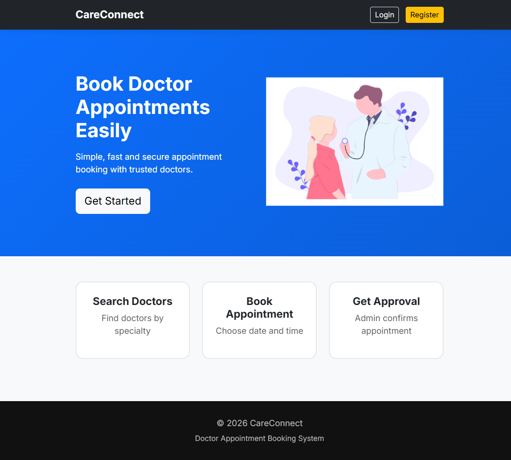
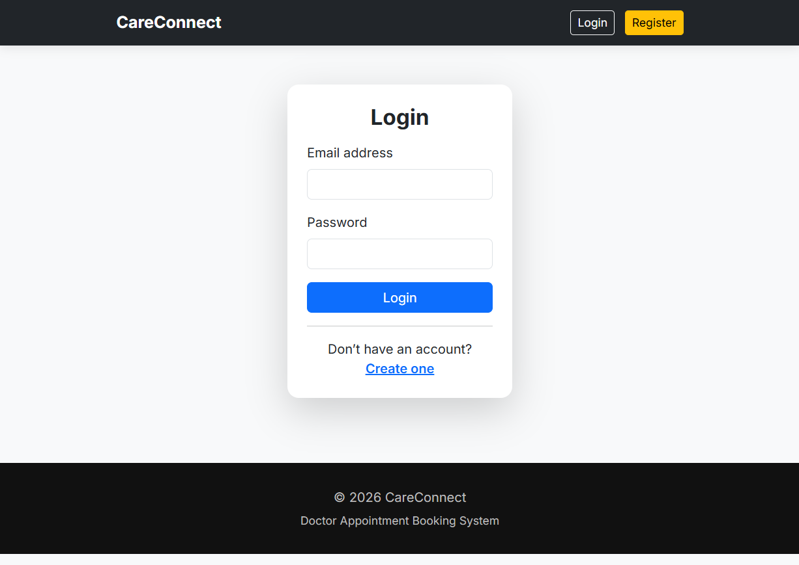
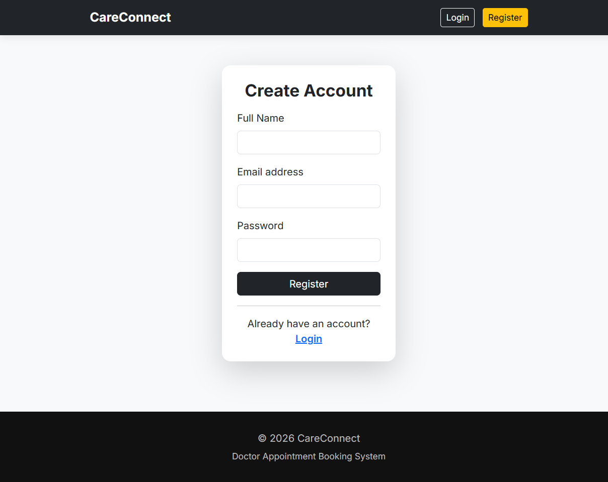
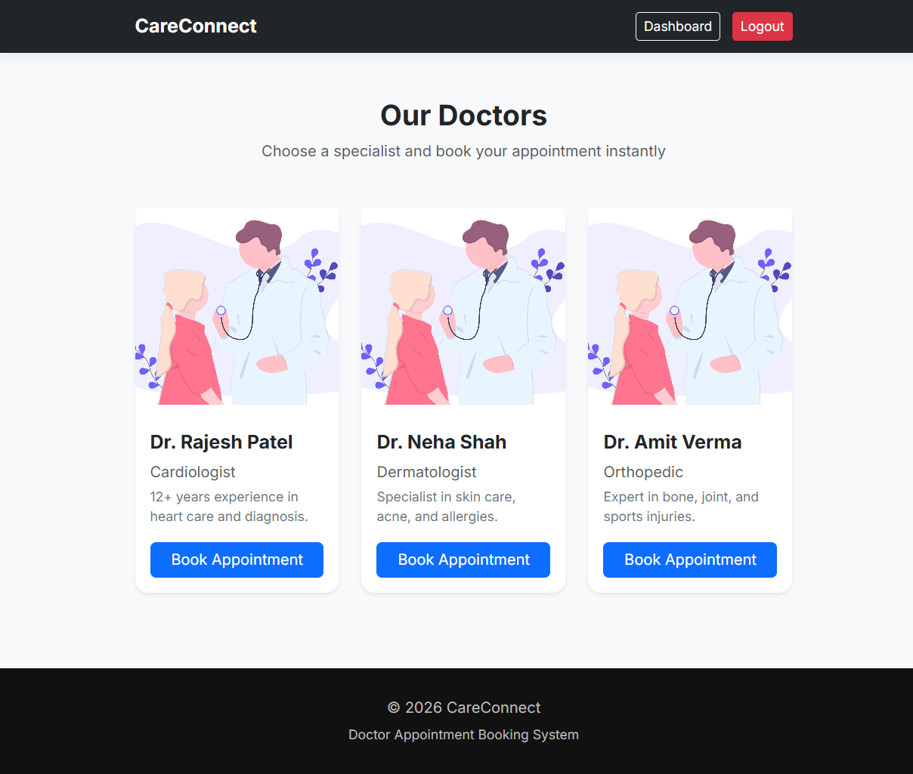
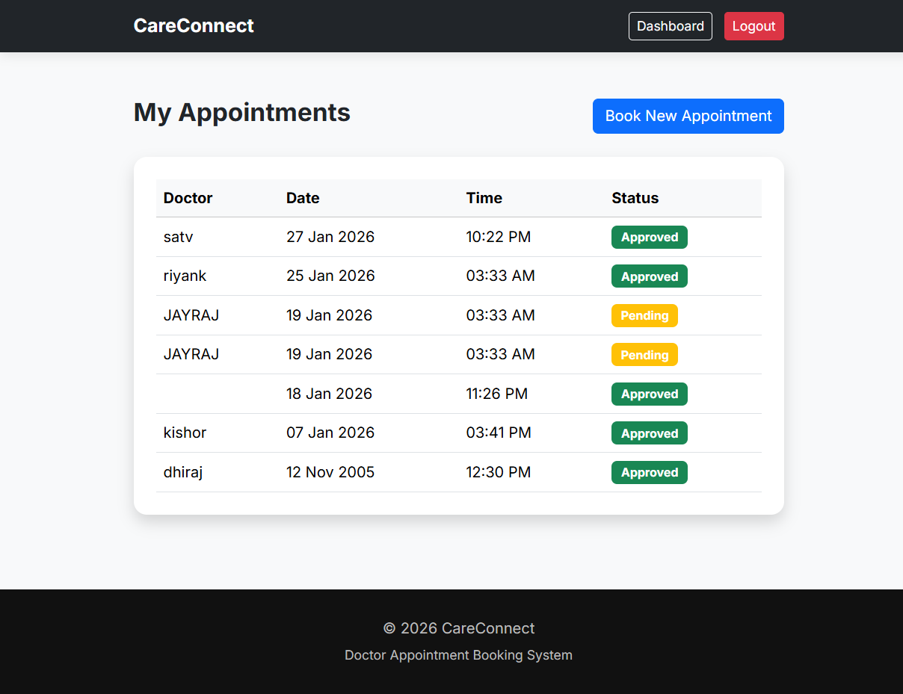
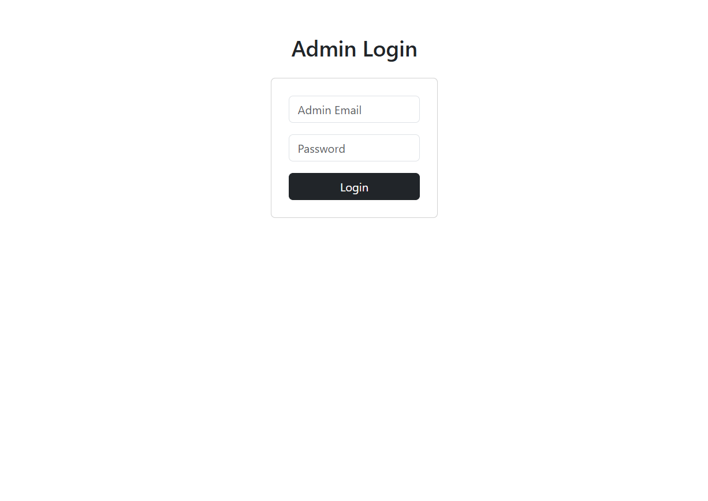
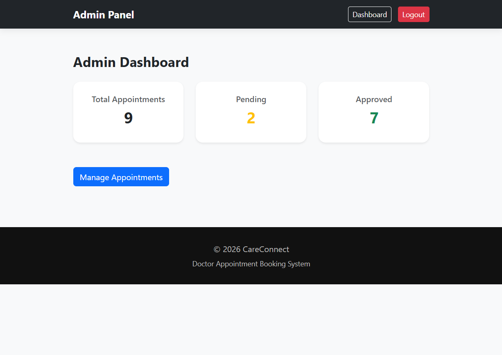
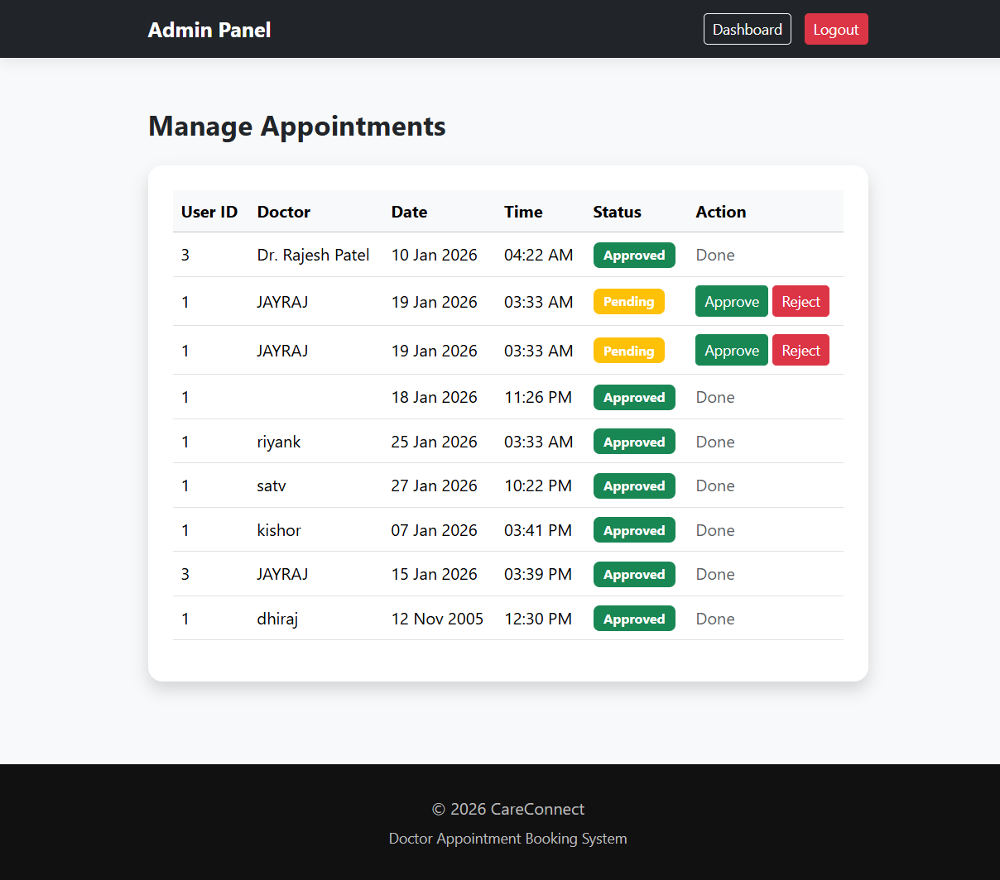

# CareConnect – Doctor Appointment Booking System

CareConnect is a web-based Doctor Appointment Booking System built using PHP, MySQL, HTML, CSS, and Bootstrap.

## Features

### User
- Register & Login
- View doctors
- Book appointments
- View appointment status (Pending / Approved / Rejected)

### Admin
- Secure admin login
- Dashboard with statistics
- View all appointments
- Approve / Reject appointments

## Tech Stack
- Frontend: HTML, CSS, Bootstrap 5
- Backend: PHP (PDO)
- Database: MySQL
- Tools: XAMPP, VS Code

## How to Run Locally
1. Install XAMPP
2. Place project inside `htdocs`
3. Start Apache & MySQL
4. Import database (`doctor_appointment_db`)
5. Open browser: http://localhost/doctor-appointment-booking-system/

## Admin Login
Email: admin@gmail.com  
Password: admin123

---

## Screenshots

### Home Page

### User Authentication
**Login**

**Register**

### Doctors Listing

### Booked Appointments (User)

### Admin Login

### Admin Dashboard

### Manage Appointments (Admin)

## Note
This project was built as a learning project to understand full-stack PHP development, authentication, and role-based access.

